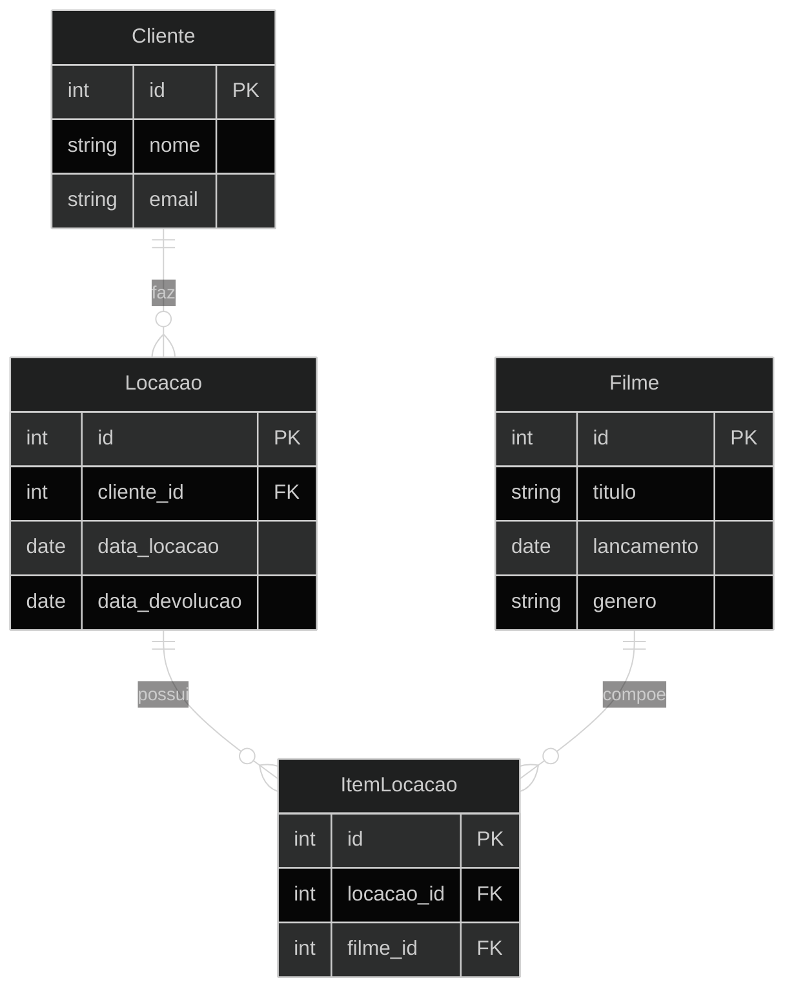

```mermaid
---
config:
    theme: dark
---
erDiagram
Cliente {
    int id PK
    string nome
    string email
}
Filme {
    int id PK
    string titulo
    date lancamento
    string genero
}
ItemLocacao {
    int id PK
    int locacao_id FK
    int filme_id FK
}
Locacao {
    int id PK
    int cliente_id FK
    date data_locacao
    date data_devolucao
}

Cliente ||--o{ Locacao : faz
Locacao ||--o{ ItemLocacao : possui
Filme ||--o{ ItemLocacao : compoe
```